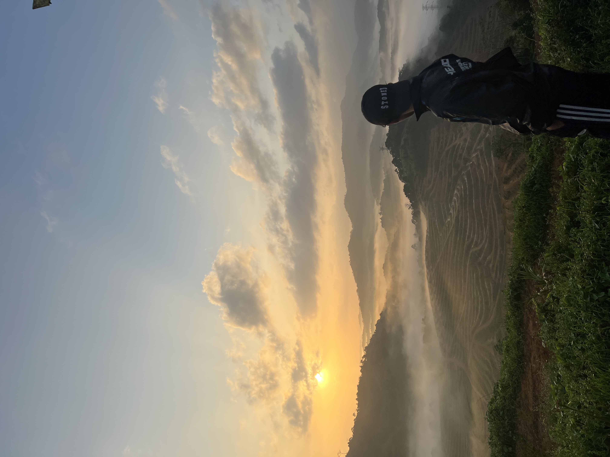

# Hi there! 👋 I'm Irfan

  

I'm a **Software Engineering** student passionate about learning new technologies and applying them to solve real-world problems. Currently, and I'm taking the WIF3005 Software Maintenance and Evolution course to gain more knowledge in software engineering field.

### About Me:
- 💻 I’m currently working on a **Personal Trainer Client Monitoring System** for my Final Year Project.

### Expectations from this Course:
I joined this course to:
- Develop a deeper understanding about **software maintainence in software engineering**.

---

### 📫 How to reach me:

### Link to my GitHub Profile:
[Visit My GitHub Profile](https://github.com/irfanhzre)

